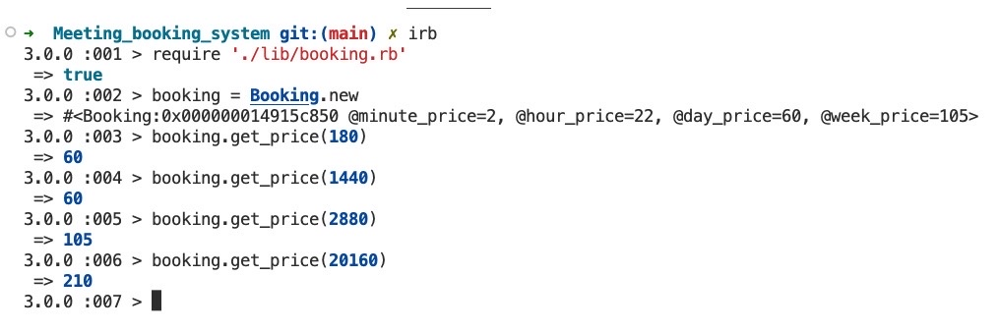
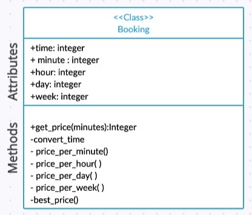

# Booking Meeting System

## Project description
The purpose of this project is to build a booking class that's intended funtionality is to calculate the price of a meeting room based upon the given meeting duration and following [min|hour|day|week] tariff:

Price per minute: £2<br>
Price per hour: £22<br>
Price per day: £60<br>
Price per week: £105<br>

## Project setup and installation

1) Start by cloning this repo:
```
https://github.com/HibaqObsiye/Meeting_Booking_System
```
2) Set-up the enviornment to use Ruby's latest version:
```
rvm get stable
rvm use ruby --latest --install --default
```
3) Run the commands below(if you don't have bundler already)
```
gem install bundler
bundle
```
## To run the project in irb

1) When in the project directory, run irb in your terminal
```
irb
```
2) Require the Booking class
```
require './lib/booking.rb'
```
3) Set up the instance for Booking class
```
booking = Booking.new
```
4) You are now able to get_price(minutes) based upon the given meeting duration and following [min|hour|day|week] tariff.
```
booking = Booking.new
booking.get_price(60)
```
## To run the test
This project uses rspec to run tests. Run the command below in the project directory terminal to see test outcome.
```
rspec
```
## Demo screenshot


### My process and challenges
For this project, my approach centered around having the idea of a Booking class.  Following the TDD process, I started by creating a simple Booking class, that had a time conversion method to change minutes into a hour,day and week format. I decided to have the minute, hour,day and week rate as an instance variable so if the company wanted to change the rate, it would only need to changed in one part of the program as opposed to changing every instance throughout the progam. Once this function was passing, I then moved on to the more challenging aspect of calculating the price per day, hour and week.I wrote individual methods for each one. I came across my first edge case. The edge case being if the user inputted a time frame that had a decimal place such as 1.5 weeks. I decided to have the minutes as a float and ceil the calculated value, which would round the value up.

Next, I moved on to creating a best_price function. I started by running simple tests, one being if 3 hours were given, the cheaper price would be the day price as opposed to the hourly price. Initially, I thought to write an if-else statement but soon realised it had poor readability. I decided to call the price calulcated method for each tariff in the best_price function and store it in an array. Lastly, I would use the '.min' method to return the smallest value.

Lastly, I aimed to refactor as the task stated to include a get_price function. I decided to create a get_price function that would be made public as that is the only function the user needs to know about. The function takes in the argument minutes which would be the user's minute input. It then calls the time conversion method and best price function. The methods mentioned in the earlier paragraphs would be kept as a private method as the user does not need to know more than the program's required functionality. 

Remaining tasks

I would like to implement a fail option if user inputs information in an incorrect format such as a string. Also, I would like a fail option if user inputed a value that is equal to or less than zero. I would like to implement a meeting class and implement it in my booking class in case user wants to specify which meeting room and have a price value per meeting room.

## Design
### UML diagram to show class with its attributes and methods
  

## Testing
Installed Simplecov for test coverage. It's currently 100%.
    
## Edge cases
- If time converted into either hour,day or week is not a whole number e.g 1.5 weeks.
- If number given is less than or equal to zero.
